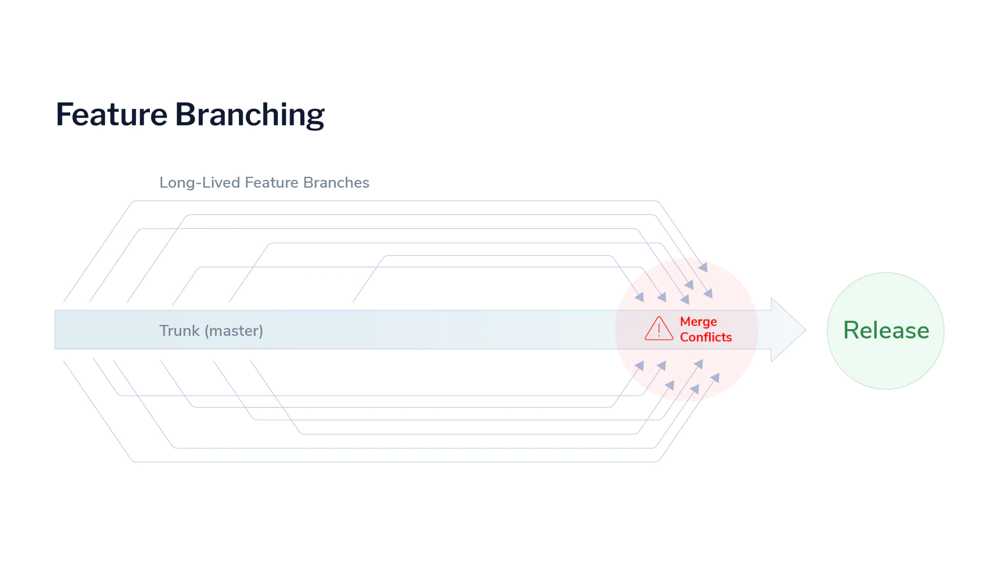

<h1 style='font-size:140px;padding-left:48px;padding-bottom:0;margin-bottom:0'>
    OJT
</h1>
<h1 style='font-size:100px;padding-left:48px;padding-top:0;margin-top:0'>
    Presentation
</h1>

--- 

<Steps style="font-size:40px">

- Code Smell &#128169;

- Git Branch 전략 

- Jira 
  Confluence 
  BitBucket 
  
- 애자일(Agile) &#128260;

</Steps>

---

<h1 style='font-size:88px'>Code Smell</h1>

> 코드의 수정/확장을 어렵게 하거나, 에러를 발생시킬만한 코드에 '악취(Bad Smell)'가 난다고 한다.
 즉 **Smell**이란 직접적인 컴파일, 런타임 에러나, 버그를 의미하는 것이 아니라, 기본적인 설계 원칙을 위반하고(설계 원칙, 패턴은 개발과 유지/보수를 용이하게 하기 때문) 코드 품질을 저하시키는 특정 구조이다.

---

# Types

### 코드 스멜의 여러 유형들을 크게 5가지 카테고리로 분류하면
- 단일 Method와 Class가 방대해지는 경우 (Bloaters)
- 수정을 어렵게 하는 경우 (Change Preventers)
- 객체 지향적 설게를 어렵게 하는 경우 (Object-Orientation Abusers)
- 의미 없는 부분들이 많은 경우 (Dispensables)
- 모듈 간 종속성이 심한 경우 (Couplers)

---

|카테고리             | 유형                                                             |
|-------------------|-----------------------------------------------------------------|
| Bloaters          | 긴 메소드, 데이터 덩어리, 거대한 클래스, 기본 타입 강박, 긴 파라미터 리스트      |
| O-O Abusers       | 다른 인터페이스를 갖는 대체 클래스, 거부된 유산, 임시 필드, Switch문          |
| Change Preventers | 확산적 변경, 평행 상속 계층구조, 산탄총 수술                               |
| Dispensables      | 주석, 데이터 클래스, 게으른 클래스, 코드 중복, 추측성 일반화                  |
| Couplers          | 기능에 대한 욕심, 불완전한 라이브러리, 미들 맨, 부적합한 친밀 관계, 메시지 체인   |

---
<!-- class: title-topleft -->

## A-1) Long Method (긴 메소드)

---

## A-2) Data Clump (데이터 덩어리)

---

## A-3) Large Class (거대한 클래스)

---

## A-4) Primitive Obsession (기본 타입에 대한 강박)

---

## A-5) Long Parameter List (긴 파라미터 리스트)

---

## B-1) Alternative Classes with Different Interface (다른 인터페이스를 가진 대체 클래스)

 두 클래스가 동일한 기능을 하는데 메소드명이나 메소드 타입(시그니처)만 다르다... 기존에 작성해놓은 클래스를 잊어버렸을 수도 있다.

---

## B-2) Refused Bequest (거부된 유산)

 **거부된 유산이란, 자식 클래스가 부모 클래스의 일부만 사용하고 나머지는 사용하지 않는 경우를 빗대어 말함.  그런 것들은 사용되지 않거나 어쩔 수 없이 재정의해야 하는 경우 에러를 발생시킬 수 있다.** 

 **어쩌다 갑자기 부모 클래스의 일부 기능만 재사용하고자 상속받은 경우에 발생할 수 있다.**

- 부모 클래스 일부 기능을 사용하되, 공통되는 개념을 사용하지 않는 경우는, 상속보다는 결합(Composition)으로 관계를 바꾸어 대상의 메소드를 호출(delegate)하는 것이 낫겠다.
- 상속이 꼭 적합하다면, 사용하지 않는 부모 클래스의 필드나 메소드는 또다른 자식클래스로 내려버리자.

---

## B-3) Temporary Field (임시 필드)

**임시 필드는 특정 상황에서만 값을 갖는다. 그 말은,**

**보통 어떤 메소드 파라미터가 많을 때,** '클래스 내부 필드로 만들어 버리자' **하는 생각에 필드로 작성해버린 다음에 다른 기능에서는 사용되지 않는, 그런 상황에서 Temporary Field는 생긴다.**

- Temporary Field와 사용하는 코드들을 별도 클래스로 추출하자. **(Replace Method With Method Object)**
- 아니면 Temporary Field에 값이 없을 때를 대비해서, **Null Class (기존 클래스를 상속받되 Temporary Field가 Null일 경우의 로직을 작성해놓은 클래스)**를 정의해놓고 객체 생성 시 branch에서 **Null Object** 생성 여부를 판단한다.

---

## B-4) Switch 문

---

## C-1) Divergent Change (확산적 변경)

---

## C-2) Parallel Inheritance Hierarchies (평행 상속 구조)

 **어떤 클래스의 자식클래스(subclass)를 만들어야 하는 상황에서, 또다른 클래스를 위해 자식클래스를 만들 필요가 생길 수도 있다.** 

ex) 다른 계층에 속하는 자식 클래스들이 표현하는 대상들이 서로 비슷한 그룹에 속할 때

    (엔지니어 - **컴퓨터** 엔지니어  vs  프로젝트 - **컴퓨터** 프로젝트)

**SRP는 만족할 수 있다, 하지만...** 

**그런** **계층구조(hierarchy)가 작을 때는 괜찮을지라도, 새 클래스들이 더해지면 더해질수록 수정이 더 어려워질 것이다. 확산적으로 변경이 일어날 수 있고, 클래스를 계층 별로 추가해야 한다.**

- 클래스 계층끼리의 중복을 제거하자
    - 우선 한 쪽 계층의 객체들이 다른 쪽 계층의 객체들을 참조하도록 하고,
    - 참조된 쪽을 하나의 클래스로 만들어서 계층 관계를 없애라
- 아니면 계층을 공통된 인터페이스를 갖는 하나의 계층으로 합칠 수도 있다.

**위를 수행한 결과가 더 복잡한 코드를 만든다면 당연히 적용하지 않는게 바람직하다**

---

## C-3) Shotgun Surgery (산탄총 수술)

---

## D-1) Comment (주석)

**주석은 코드가 명확하지 못하고 직관적으로 이해가 안될 때 부연설명을 위해 작성자가 다는 것이다. 자칫하면 안좋은 코드를 가리기 위해 남용될 수 있다.** 

 **메소드, 클래스 네이밍에 신경써서 주석의 필요성을 최소화하자.**

 

- 복잡한 표현식은 변수화
- 코드 일부를 설명하지 말고 메소드화, 그리고 스스로 설명이 되도록 이름 수정
- 특정 부분이 실행될 때 어떤 상태가 필수적이라면 주석을 통한 설명보다 Assertion 을 삽입해 상태가 보장되도록, 아니라면 예외가 발생하도록 한다.

---

## D-2) Data Class (데이터 클래스)

**필드와 getter/setter만 작성된 클래스? 그저 Container 일 뿐, 기능을 하지 않고, 스스로의 데이터에 독립적으로 행하는 연산이 없다.**

- 일반적인 getter/setter 대신 immutable (read-only)을 반환하는 getter와 add/remove함수로 대체한다
- 이 Data Class를 사용하는 클래스에서 로직을 옮겨 Data Class 내부 메소드로 작성하고,  그 전에 존재하던 getter/setter와 갖는 내부 데이터 접근 메소드들은 삭제한다.

---

## D-3) Lazy Class (게으른 클래스)

**어떤 클래스를 실제로 별로 필요로 하지 않는다면 유지보수 하는데 쓸데없는 비용이 더 들기 전에 없애라.** 

 **경우에 따라 리팩토링을 실행했더니 어떤 클래스가 엄청 작아질 수도 있는거고, 아니면  추가될 가능성이 희박한 기능을 위해 작성된 것일 수도 있다** 

 

- **inline Class.** 즉 다른 클래스에 추가해버리거나,
- 어떤 클래스의 자식클래스일 경우 부모로 합쳐버리자.**(Collapse Hierarchy)**

---

## D-4) Code Duplication (코드 중복)

---

## D-5) Speculative Generality (추측성 일반화)

 **실제 사용되지 않는 클래스, 메소드, 필드, 파라미터 등의 요소가 너무 많은...! 경우**

**가끔 "만일을 대비" 해서 쓰이지 않을 기능을 미리 코드로 작성해놓을 때가 있다. 결과적으로 나중에 이해하기가 어려워진다.**

다음 것들은 제거하거나, 클래스의 경우 하나로 합치고, 메소드의 경우 사용하는 곳에서 내용을 인라인 형태로 바꾸자

- 굳이 없어도 되는 추상클래스.
- 불필요하게 기능을 구분하기 위해 나누어진 클래스나 메소드.
- 사용되지 않을 메소드, 파라미터, 필드

 **프레임워크, 라이브러리** 같은 경우는 많은 메소드, 클래스 들이 내부에서는 쓰이 지 않아도 사용자들이 가져다 쓸 걸 예상하고 작성된 것이다.

삭제하기 전 **단위 테스트에서 사용되지 않는지 확인**하자.

---

## E-1) Feature Envy (기능에 대한 욕심)

---

## E-2) Incomplete Library Class (불완전한 라이브러리 클래스)

 **라이브러리가 업데이트 되거나/되지 않아서 시스템과 호환되지 않는 경우가 생길 수 있다... 하지만 사용자가 고칠 수 없는 경우가 많음.**

---

## E-3) Middle Man (미들 맨)

 **클래스가 한 가지 기능만 한다면 다른 클래스가 역할을 하게 하면 되지 뭐하러 만드나요**

**메시지 체인을 너무 지나치게 간소화하려다 보면 Middle Man 상황에 마주할 수 있다.** 

- 다른 객체에 너무 많은 기능을 위임하는 경우, 이 Middle Man을 없애서 실제 기능을 하는 객체 구현을 알 필요가 있겠다.

---

## E-4) Inappropriate Intimacy (부적합한 친밀 관계)

**클래스 간 결합도(Coupling)가 지나치게 높아지는 경우**

(한 클래스가 다른 쪽의 필드들과 메소드들을 대거 사용)

**기능을 캡슐화해서 최대한 클래스들 끼리 종속성을 낮추는 것이 좋다. 그래야 재사용성이 높아지고 보수가 쉬워진다.**

- 한 쪽이 사용하지 않는 메소드, 필드가 있으면 다른 쪽으로 이동하자
- 공통적으로 사용하는 기능이 있으면 클래스로 추출하자
- 서로를 참조하는 관계를 단방향 참조로 바꿀 수 있는지 확인해보자
- 한 클래스의 여러 메소드가 다른 클래스에 기능을 위임하고 있으면, 상속과 오버라이딩 관계로 전환할 수 있다.

---

 
## E-5) Message Chain (메시지 체인)

**연속된 호출의 형태.  어떤 객체를 요청하고, 그 객체가 또다른 객체를 요청하고... 의 반복.**

**클라이언트(객체 사용자)는 체인에 종속되고, 중간에 생기는 변경은 클라이언트에도 변경을 유발한다.** 

- **Hide Delegate (대리객체를 숨기기)** 를 사용하자.

    ex. **A**는 **B**가 참조하는 **C**의 기능(메소드)를 사용하고자 한다. 이 때  **A**가 **B(Delegate)**를 통해 **A.getB().getC()** 의 형태로 사용하지 말고, 단일 메소드**(A.getC())**로 작성해서 호출한다면 **C**를 사용할 때 **B**의 존재와 **B**를 거쳐야 한다는 사실을 숨길 수 있다. 

    하지만 Hide Delegate를 너무 적극적으로 사용해서 실제 기능이 어디서 작동하는지 파악하기 힘들어지는 상황은 피해야 할 것이다.

- 체인을 통해 궁극적으로 사용하고자 하는 기능을 추출해서 체인을 거치지 않고 시작에 사용할 수 있도록 옮기자.

--- 

<h1 style='font-size:88px'>Git Branch 전략</h1>

---

# Git 

**SW 의 버전을 관리할 수 있도록 도와주는 무료, 오픈소스 버전(형상) 관리 시스템**

작업 중 변경사항 들을 기록하여 현재 상태의 버전을 생성할 수 있으며 이전/다음 버전들로 상태를 전환하는 것이 가능하다.  또한 브랜치(Branch) 기능을 통해 SW 개발에 대한 협업을 가능케한다.

---

## Branch

  코드의 특정 버전에서 Branch 를 생성하여 버전의 한 '갈래'를 논리적으로 분리할 수 있다.

 브랜치를 통해 같은 소스 코드들에 대해 한 팀에 속하는 여러 SW 개발자들이 각자의 브랜치에서 동시에 병렬적으로 작업이 가능하다. 대신 각자의 작업이 완료된 후 원래의 코드에 병합(Merge)하는 과정을 거쳐야 한다.

---

# Branching 전략

 **Git 과 같은 버전 관리 시스템을 사용함에 있어서,  SW개발 팀에서 오류 없이 개발자들이 서로 동시에 개발하기 위해 'Branch'를 어떻게 사용할지에 대한 전략**

 같은 코드베이스에 대해 한 팀으로 작업하는 SW 개발자들은 개발 중인 어플리케이션의 기능 오류를 최소화하면서 변경 사항을 서로 공유해야한다. 브랜치 전략은 그러한 팀들이 동일한 코드에 대해 서로 엉키지 않고 협업할 수 있도록 하는 것이 목표이다.

---

### **Merge Conflicts(병합 충돌)**

 개발팀에서는 복잡하게 얽힌 브랜치들을 한 번에 마스터로 머지해야하는 경우를 마주하곤 한다. 개발자들이 빨리 변경사항을 서로 합치지 않을수록 나중에 각자의 브랜치들로 인해 충돌(Conflict)이 발생할 가능성이 높아진다. 

--- 

  충돌 발생 시 Git이 지원하는 브랜치 간 자동 병합(auto merging)을 처리하지 못하므로 직접 코드를 합치기 위해 시간을 낭비하게 되며, 잘못하면 변경 사항이 사라지거나, 수정하기 전 문제가 있던 코드로 복구되는 경우가 발생한다.

그래서 팀에서는 **상황에 따른 공통의 올바른 전략**을 세움으로써 **동일한 프로세스로 SW 개발 작업을 진행**하여 **효율, 정확성을 향상**시킬 필요가 있다.

---

## Branch 구분

 **여러 브랜치 전략에서는 브랜치를 역할에 따라 분류해서 용도에 맞게 사용한다.**

- **Trunk(master)**

 일반적으로 알고 있는 master(main, mainline...) 브랜치를 의미한다. 레포지토리를 처음 생성 시 최초 브랜치로 마스터가 존재하고, 실제 브랜치 전략에 따라 변경사항이 마스터로 적용되는 시점이 다양해진다. 또한 실제 배포 준비가 된 버전이 Release에서 마스터에 병합된다.

 TBD 에서는 중심 브랜치가 되어서 개발자들이 모든 변경사항을 마스터에 적용하게 된다 (아래에서 설명)

- **Develop**

 배포되기 전에 개발자들이 Feature 브랜치들로부터 수정사항들을 적용하는 개발 전용 브랜치. 오래 지속되는 Feature 브랜치라고도 할 수 있다. 마스터로부터 분기되서 마스터와 평행하게 유지되고, 없애지 않는다.  

 테스트 환경과 같이 비-배포환경 전용으로 동작하는 Dev 브랜치를 둘 수도 있다.  
  

- **Feature**

 일반적으로 각 기능 단위 개발이나 이슈 해결을 위한 브랜치. 브랜치 전략에 따라 짧게 혹은 병합하지 않고 길게 남겨놓을 수 있다. 보통 한 명의 개발자가 파지만, 다른 개발자들과 공유될 수도 있다. 

 브랜치 전략에 따라서 Feature Branch를 어떻게 정의할지가 달라질 수 있다.

- **Release**

마찬가지로 전략에 따라 수명이 갈리지만, 제품을 배포하기 위해 개발된 기능, 변경 사항들이 반영된다. 소규모의 버그 수정을 할 수도 있다.

- **Hotfix**

 급하게 버그 수정을 위한 브랜치. 일반적으로 Release 브랜치(배포판) 에서 나뉘어져서 오랫동안 존재한다. 주로 명시적으로 버전이 지정된, 설치해서 사용하는 응용 프로그램 같은 경우에 더 흔히 핫픽스 브랜치가 생성된다.

---

# Git Flow

**다음 그림은 Git-Flow에서의 브랜치들의 관계와 병합 순서를 나타낸다.**

위에서 설명한 브랜치 종류들(Master/Trunk, HotFix, Release, Dev(elopment), Feature)이 모두 사용된다. 그리고 배포를 위한 변경들이 마스터(Trunk)에 전부 반영이 된다. 

 실제 배포 버전들만 병합할 Master와 기능 단위로 병합하는 개발 전용 브랜치인 Develop을 따로 둔다. Develop에서 기능 별로 Feature를 생성, 개발 완료 후 머지하고, 배포를 해야할 때는 Develop에서 Release를 생성해서 간단한 버그 수정 후에 Master와 Develop에 각각 병합한다. HotFix 같은 경우는 Master에서 바로 생성하여 변경이 완료되었으면 Release와 마찬가지로 Master와 Develop에 머지한다. 

### 단점

 GitFlow를 따르면, Git에 익숙하지 않은 개발자들이 브랜치 모델을 배우고 적용한다면 생산성을 빨리 갖출 수 있다. 하지만 산업 트렌드가 바뀌어 가면서 GitFlow 방식이 내재하던 결함이 노출되어왔다.  많은 양의 수명이 긴 브랜치들을 관리하는 것이 팀에게 큰 부담이 된 것이다.

 Feature 브랜치에서의 개발 규모를 작고 오래가지 않게 하는 교육을 받지 못한 팀은 나중에 Dev 브랜치로 병합할 때 발생할 만한 충돌(merge conflict)들로 인해 상당한 고난을 겪게 될 것이다.  

 또, 각 브랜치들을 유지하는데 필요한 노력의 레벨도 팀에게 부담을 더했다.

**조금 더 복잡한 흐름**

---

## GitHub Flow

 **GitHub Flow**는 GitFlow보다 간단한 대안으로, GitHub에 의해 유명해졌다.

 GitFlow를 제시한 Vincent Driessen도 설치형 SW보다 웹 서비스형 SW가 많아지는 지금, GitFlow보다 GitHub Flow 방식이 SW 개발팀을 위한 더 나은 방식이라고 말했다.
[https://nvie.com/posts/a-successful-git-branching-model/](https://nvie.com/posts/a-successful-git-branching-model/)  

워크플로우(Workflow)는 다음과 같으며 GitFlow보다 간단하다. master를 중심으로 하여 변경이 이루어지고, 대신 master로의 병합을 위해서 **PR(Pull Request)**를 생성하기 때문에 리뷰를 유도할 수 있다.

- 마스터(Trunk)는 항상 릴리즈가 가능한 버전이어야 한다. 즉. 해당 버전 코드를 사용해 바로 서비스할 수 있어야 한다, 그러므로 업데이트가 무분별하게 이루어지지 않도록 특정 규칙을 두고 관리해야 한다.
- 각 개발자는 마스터로의 변경을 위해 마스터로부터 Feature 브랜치를 만든다. Develop 브랜치를 별도로 두지 않으므로 GitHub 홈페이지(Remote)에서 Feature 브랜치를 통해 기능을 파악하기 쉽게 네이밍에 신경을 쓴다.
- 개발자는 Local에서 Remote의 저장소로 수시로 Push를 실천한다.
- Feature 브랜치들은 검증을 위한 테스트 환경에 배포되거나, 마스터로 직접 push되어 non-production 환경으로 배포된다.

 전략이 단순하기에 Git에 익숙하지 않은 사람도 접근하기 쉽다. 그리고 GitHub의 여러 기능을 이용하는 방식이기에 부가적인 효과를 얻을 수 있다(PR 이후 코드 리뷰, WebHook 사용한 자동 빌드 및 배포 등). 마스터를 통해 주로 배포하고, 각 브랜치들이 바로 마스터에 병합되기에 배포가 잦은 경우에 적합하며 원활한 작업을 위해 CI, 배포 자동화가 필요하다.