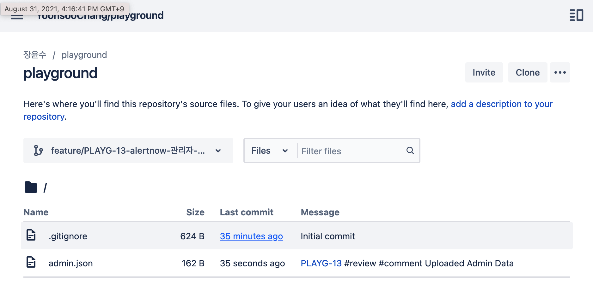

<h1 style='font-size:140px;padding-left:48px;padding-bottom:0;margin-bottom:0'>
    OJT
</h1>
<h1 style='font-size:100px;padding-left:48px;padding-top:0;margin-top:0'>
    Presentation
</h1>

---

<Steps style="font-size:40px">

## Contents

- Code Smell &#128169;

- Git Branch 전략 

- Jira 
  Confluence 
  BitBucket 
- 애자일(Agile) &#128260;

</Steps>

---

<h1 style='font-size:88px'>Code Smell</h1>

> 코드의 수정/확장을 어렵게 하거나, 에러를 발생시킬만한 코드에 **'악취(Bad Smell)'**가 난다고 한다.
>  즉 **Smell**이란 직접적인 컴파일, 런타임 에러나, 버그를 의미하는 것이 아니라, 기본적인 설계 원칙을 위반하고(설계 원칙, 패턴은 개발과 유지/보수를 용이하게 하기 때문) 코드 품질을 저하시키는 특정 구조이다.

---

# Types

## 크게 5가지 카테고리로 분류

- 단일 Method와 Class가 방대해지는 경우 (Bloaters)
- 객체 지향적 설계를 어렵게 하는 경우 (Object-Orientation Abusers)
- 수정을 어렵게 하는 경우 (Change Preventers)
- 의미 없는 부분들이 많은 경우 (Dispensables)
- 모듈 간 종속성이 심한 경우 (Couplers)

---

| 카테고리          | 유형                                                                            |
| ----------------- | ------------------------------------------------------------------------------- |
| Bloaters          | 긴 메소드, 데이터 덩어리, 거대한 클래스, 기본 타입 강박, 긴 파라미터 리스트     |
| O-O Abusers       | 다른 인터페이스를 갖는 대체 클래스, 거부된 유산, 임시 필드, Switch문            |
| Change Preventers | 확산적 변경, 평행 상속 계층구조, 산탄총 수술                                    |
| Dispensables      | 주석, 데이터 클래스, 게으른 클래스, 코드 중복, 추측성 일반화                    |
| Couplers          | 기능에 대한 욕심, 불완전한 라이브러리, 미들 맨, 부적합한 친밀 관계, 메시지 체인 |

---

<!-- class: title-topleft -->

## A-1) Long Method (긴 메소드)

길이가 너무 긴 메소드의 경우 여러가지 방법을 통해 줄일 수 있다.

내용이 긴 경우 일부를 새로운 함수로 추출해 호출하거나,
클래스 메소드로 추출하여 인스턴스를 갖도록 하여 호출할 수 있다. 

---

## A-2) Data Clump (데이터 덩어리)

클래스 필드들을 의미 상 분류할 수 있는 경우 개별적인 클래스를 생성해 포함시킨다.                     

어떤 필드 묶음을 사용하는 코드에서 그 중 하나를 제거했을 때 의미가 유지되지 않으면 하나의 **Clump**로 판단할 수 있다.

---

## A-3) Large Class (거대한 클래스)

### 클래스가 너무 많은 역할을 하게 되면?

 사용처도 늘어나고 인스턴스의 수도 그만큼 늘어날 것이다. 
 그만큼 코드의 중복이 늘어나고 유지보수에 문제가 생길 가능성이 높아진다.
 
 기능을 둘로 나눌 수 있으면 별도 클래스로 추출하고, 비슷한 맥락에서 여러 방식으로 구현될 수 있으면 상속 관계(서브 클래스나 인터페이스)를 만들어준다.

> 멤버를 기억해야 하는 부담이 줄고, 코드 중복이 줄어든다.

---

## A-4) Primitive Obsession (기본 타입에 대한 강박)

꼭 기본타입(Primitive)를 써야하는가? 레코드(record, class, user-defined...)타입을 새로 정의해서 사용하자.

처음에 한 가지 타입의 데이터만 사용할 경우에는 값을 저장하기 위해 기본타입을 사용한다.
하지만 그러다가 여러 타입의 다른 필드들이 필요해져서 클래스가 커진다면?

그룹화할 수 있는 필드들을 새 클래스로 추출해서 인스턴스를 갖도록 하자.

---

## A-5) Long Parameter List (긴 파라미터 리스트)

하나의 메소드가 3,4개보다 많은 파라미터를 받는 경우,
각각을 이해하고 사용하기 힘들다, 순서에도 결과가 영향을 받는다. 

만일 여러 알고리즘이 이 메소드를 거치게 되면 파라미터 개수가 많아질 수 있다.  어떤 알고리즘이 실행될 지를 판단해야 하기 때문.

- 만약 인자들 중에 다른 객체의 메소드가 반환한 값들이 여럿 있으면, 그 인자들 대신 이 객체 자체를 인자로 넘겨서 받은 쪽에서 쿼리를 실행하도록 한다.  **객체로부터 여러 값을 뽑아내서 인자 수가 늘어날 바엔 객체 자체를 넘기라는 말**

만약 인자들을 객체로 묶어 사용하는 것이 원치않은 의존관계를 불러 일으킨다면 사용하지 않는 것이 낫다.

---

## B-1) Alternative Classes with Different Interface (다른 인터페이스를 가진 대체 클래스)

두 클래스의 메소드가

- **동일한 기능**을 하지만,
- **이름이나 타입(return, parameter 타입)만 다른** 경우.

Rename Methods, Parameterize Method, Extract Superclass.

---

## B-2) Refused Bequest (거부된 유산)

자식 클래스가 부모 클래스의 일부만 사용하고 나머지는 사용하지 않는 경우.
사용되지 않거나 어쩔 수 없이 재정의해야 하는 경우 에러를 발생시킬 수 있다.

**어쩌다 갑자기 부모 클래스의 일부 기능만 재사용하고자 상속받은 경우에 발생할 수 있다.**

- 상속보다는 결합(Composition)으로 관계를 바꾸어 대상의 메소드를 호출(delegate)하는 것이 낫다.
- 상속이 꼭 적합하다면, 사용하지 않는 부모 클래스의 필드나 메소드는 다른 자식클래스로 내려버리자.

---

## B-3) Temporary Field (임시 필드)

임시 필드는 특정 상황에서만 값을 갖는다.
보통 어떤 클래스 필드 수가 많을 때, 특정 상황(메소드)에서만 값이 세팅되는 필드가 생길 수 있다.

('클래스 내부 필드로 만들어 버리자' 하는 생각에 필드로 작성해버렸을 수 있음)

- Temporary Field + 종속된 코드 → 클래스 추출 **(Replace Method With Method Object)**
- 아니면 Temporary Field에 값이 없을 때를 대비해서, **Null Class (기존 클래스를 상속받되 Temporary Field가 Null일 경우의 로직을 작성해놓은 클래스)** 를 정의해놓고 객체 생성 시 **Null Object** 인지 아닌지 판단한다.

---

## B-4) Switch 문

객체 지향의 다형성 개념을 이용하면 switch 문의 중복된 코드를 분리할 수 있다.

경우의 수가 많지 않고, 시스템 내에서 해당 switch 분기문 자체로 인해 기능이 크게 분화되는 것이 아니라면
다형성을 지원한다고 여러 클래스를 생성하는 게 오버헤드가 더 클 수도 있다.

---

## C-1) Divergent Change (확산적 변경)

하나의 클래스가 여러 가지 이유로 자주 변경되는 경우

SRP(단일 책임 원칙)을 만족시키도록 클래스를 추출하되,
만약 추출한 클래스와 공통적인 기능이 있는 경우 부모-자식(super-sub)관계를 
유지하도록 하면 된다. 

---

## C-2) Shotgun Surgery (산탄총 수술)

**확산적 변경** 과 반대로 한 가지 변경 사항이 여러 클래스의 수정을 조금씩 불러오는 경우이다 
그렇다면 해당 변경 부분을 기존 클래스나 새로운 클래스로 이동시켜야 한다.

---

## C-3) Parallel Inheritance Hierarchies (평행 상속 구조)

**어떤 클래스의 자식클래스(subclass)를 만들어야 하는 상황에서, 또다른 클래스를 위해 자식클래스를 만들 필요가 생길 수도 있다.**

ex) 다른 계층에 속하는 자식 클래스들이 표현하는 대상들이 서로 비슷한 그룹에 속할 때

    (엔지니어 - 컴퓨터 엔지니어  vs  프로젝트 - 컴퓨터 프로젝트)

---

## C-3) Parallel Inheritance Hierarchies (평행 상속 구조)

**SRP는 만족할 수 있다, 하지만...**

**계층구조(hierarchy)가 작을 때는 괜찮을지라도, 새 클래스들이 더해지면 더해질수록 수정이 더 어려워질 것이다. 확산적으로 변경이 일어날 수 있고, 클래스를 계층 별로 추가해야 한다.**

- 클래스 계층끼리의 중복을 제거하자
  - 우선 한 쪽 계층의 객체들이 다른 쪽 계층의 객체들을 참조하도록 하고,
  - 참조된 쪽을 하나의 클래스로 만들어서 계층 관계를 없애라
- 아니면 계층을 공통된 인터페이스를 갖는 하나의 계층으로 합칠 수도 있다.

---

## D-1) Comment (주석)

**주석은 코드가 명확하지 못하고 직관적으로 이해가 안될 때 부연설명을 위해 작성자가 다는 것이다. 자칫하면 안좋은 코드를 가리기 위해 남용될 수 있다.**

**메소드, 클래스 네이밍에 신경써서 주석의 필요성을 최소화하자.**

- 복잡한 표현식은 변수화
- 코드 일부를 설명하지 말고 메소드화, 그리고 스스로 설명이 되도록 이름 수정
- 특정 부분이 실행될 때 어떤 상태가 필수적이라면 주석을 통한 설명보다 Assertion 을 삽입해 상태가 보장되도록, 아니라면 예외가 발생하도록 한다.

---

## D-2) Data Class (데이터 클래스)

**필드와 getter/setter만 작성된 클래스? 그저 Container 일 뿐, 기능을 하지 않고, 스스로의 데이터에 독립적으로 행하는 연산이 없다.**

- 일반적인 getter/setter 대신 immutable (read-only)을 반환하는 getter와 add/remove함수로 대체한다
- 이 Data Class를 사용하는 클래스에서 로직을 옮겨 Data Class 내부 메소드로 작성하고, 그 전에 존재하던 getter/setter와 갖는 내부 데이터 접근 메소드들은 삭제한다.

---

## D-3) Lazy Class (게으른 클래스)

**어떤 클래스를 실제로 별로 필요로 하지 않는다면 유지보수 하는데 쓸데없는 비용이 더 들기 전에 없애라.**

**경우에 따라 리팩토링을 실행했더니 어떤 클래스가 엄청 작아질 수도 있는거고, 아니면 추가될 가능성이 희박한 기능을 위해 작성된 것일 수도 있다**

- **inline Class.** 즉 다른 클래스에 추가해버리거나,
- 어떤 클래스의 자식클래스일 경우 부모로 합쳐버리자.**(Collapse Hierarchy)**

---

## D-4) Speculative Generality (추측성 일반화)

**가끔 "만일을 대비" 해서 쓰이지 않을 기능을 미리 코드로 작성해놓을 때가 있다. 결과적으로 나중에 이해하기가 어려워진다.**

- 굳이 없어도 되는 추상클래스.
- 불필요하게 기능을 구분하기 위해 나누어진 클래스나 메소드.
- 사용되지 않을 메소드, 파라미터, 필드

→ 제거하거나, 클래스의 경우 하나로 합치고, 메소드의 경우 사용하는 곳에서 내용을 인라인 형태로 바꾸자

---

## D-4) Speculative Generality (추측성 일반화)

- **프레임워크, 라이브러리** 같은 경우는 많은 메소드, 클래스 들이 내부에서는 쓰이 지 않아도 사용자들이 가져다 쓸 걸 예상하고 작성된 것이다.
   
- 혹은 삭제하기 전 **단위 테스트에서 사용되지 않는지 확인**하자.

---

## E-1) Feature Envy (기능에 대한 욕심)

어떤 클래스에 속한 메소드가 해당 클래스의 것보다 다른 클래스의 데이터를 더 필요로 할 수도 있다.
예를 들면, 다른 클래스의 필드를 사용하기 위해 getter를 많이 호출하는 경우

굳이 해당 메소드를 갖고 있을 필요 없이 데이터를 많이 필요로 하는 대상 클래스로 이동시켜 역할을 위임하면 된다.

---

## E-2) Incomplete Library Class (불완전한 라이브러리 클래스)

**라이브러리가 업데이트 되거나/되지 않아서 시스템과 호환되지 않는 경우가 생길 수 있다... 하지만 사용자가 고칠 수 없는 경우가 많음.**

---

## E-3) Message Chain (메시지 체인)

**연속된 호출의 형태. 어떤 객체를 요청하고, 그 객체가 또다른 객체를 요청하고... 의 반복.**

- **Hide Delegate (대리객체를 숨기기)** 를 사용하자.

  ex. **A**는 **B**가 **C**의 인스턴스를 통해 **C**의 기능(메소드)를 사용하고자 한다.

       B(Delegate) → A.getB().getC() vs 단일 메소드 → A.getC()

  **C**를 사용할 때 **B**의 존재와 **B**를 거쳐야 한다는 사실을 숨길 수 있다.

  하지만 실제 기능이 어디서 작동하는지 파악하기 힘들어지는 상황은 피해야 할 것이다.

---

## E-4) Middle Man (미들 맨)

**클래스가 한 가지 기능만 한다면 다른 클래스가 역할을 하게 하면 되지 뭐하러 만드나요..? (메시지 체인을 너무 지나치게 간소화하려다 보면 Middle Man 상황에 마주할 수 있다.)**

- 다른 객체에 너무 많은 기능을 위임하는 경우, 이 Middle Man을 없애서 실제 기능을 하는 객체 구현을 알 필요가 있겠다.

---

## E-5) Inappropriate Intimacy (부적합한 친밀 관계)

**클래스 간 결합도(Coupling)가 지나치게 높아지는 경우**

(한 클래스가 다른 쪽의 필드들과 메소드들을 대거 사용)

**기능을 캡슐화해서 최대한 클래스들 끼리 종속성을 낮추는 것이 좋다. 그래야 재사용성이 높아지고 보수가 쉬워진다.**

- 한 쪽이 사용하지 않는 메소드, 필드가 있으면 다른 쪽으로 이동하자
- 공통적으로 사용하는 기능이 있으면 클래스로 추출하자
- 서로를 참조하는 관계를 단방향 참조로 바꿀 수 있는지 확인해보자
- 한 클래스의 여러 메소드가 다른 클래스에 기능을 위임하고 있으면, 상속과 오버라이딩 관계로 전환할 수 있다.

---

<h1 style='font-size:88px'>Git Branch 전략</h1>

---

# Git

**SW 의 버전을 관리할 수 있도록 도와주는 무료, 오픈소스 버전(형상) 관리 시스템**

작업 중 변경사항 들을 기록하여 현재 상태의 버전을 생성할 수 있으며 이전/다음 버전들로 상태를 전환하는 것이 가능하다. 또한 브랜치(Branch) 기능을 통해 SW 개발에 대한 협업을 가능케한다.

---

## Branch

코드의 특정 버전에서 Branch 를 생성하여 버전의 한 '갈래'를 논리적으로 분리할 수 있다.

브랜치를 통해 같은 소스 코드들에 대해 한 팀에 속하는 여러 SW 개발자들이 각자의 브랜치에서 동시에 병렬적으로 작업이 가능하다. 대신 각자의 작업이 완료된 후 원래의 코드에 병합(Merge)하는 과정을 거쳐야 한다.

---

# Branching 전략

**Git 과 같은 버전 관리 시스템을 사용함에 있어서, SW개발 팀에서 오류 없이 개발자들이 서로 동시에 개발하기 위해 'Branch'를 어떻게 사용할지에 대한 전략**

같은 코드베이스에 대해 한 팀으로 작업하는 SW 개발자들은 개발 중인 어플리케이션의 기능 오류를 최소화하면서 변경 사항을 서로 공유해야한다. 브랜치 전략은 그러한 팀들이 동일한 코드에 대해 서로 엉키지 않고 협업할 수 있도록 하는 것이 목표이다.

---

## **Merge Conflicts(병합 충돌)**

개발팀에서는 복잡하게 얽힌 브랜치들을 한 번에 마스터로 머지해야하는 경우를 마주하곤 한다.

머지 간격이 늘어날수록 나중에 브랜치의 소스코드 간 충돌(Conflict)이 발생할 가능성이 높아진다.

---

## **Merge Conflicts(병합 충돌)**

충돌 발생 시, Git이 지원하는 브랜치 간 자동 병합(auto merging)을 처리하지 못하므로

> 직접 코드를 합치기 위해 시간을 낭비하게 되며,
> 잘못하면 변경 사항이 사라지거나,
> 수정하기 전 문제가 있던 코드로 복구되는 경우가 발생한다.

 

그래서 팀에서는 **상황에 따른 공통의 올바른 전략**을 세움으로써 **동일한 프로세스로 SW 개발 작업을 진행**하여 **효율, 정확성을 향상**시킬 필요가 있다.

---

## Branch 타입 1)

**여러 브랜치 전략에서는 브랜치를 역할에 따라 분류해서 용도에 맞게 사용한다.**

- **Trunk(master)**

일반적으로 알고 있는 master(main, mainline...) 브랜치를 의미한다. 레포지토리를 처음 생성 시 최초 브랜치로 마스터가 존재하고, 실제 브랜치 전략에 따라 변경사항이 마스터로 적용되는 시점이 다양해진다. 또한 실제 배포 준비가 된 버전이 Release에서 마스터에 병합된다.

TBD 에서는 중심 브랜치가 되어서 개발자들이 모든 변경사항을 마스터에 적용하게 된다 (아래에서 설명)

---

## Branch 타입 2)

- **Develop**

배포되기 전에 개발자들이 Feature 브랜치들로부터 수정사항들을 적용하는 개발 전용 브랜치. 오래 지속되는 Feature 브랜치라고도 할 수 있다. 마스터로부터 분기되서 마스터와 평행하게 유지되고, 없애지 않는다.

테스트 환경과 같이 비-배포환경 전용으로 동작하는 Develop 브랜치를 둘 수도 있다.

---

## Branch 타입 3)

- **Feature**

일반적으로 각 기능 단위 개발이나 이슈 해결을 위한 브랜치. 브랜치 전략에 따라 짧게 혹은 병합하지 않고 길게 남겨놓을 수 있다. 보통 한 명의 개발자가 파지만, 다른 개발자들과 공유될 수도 있다.

브랜치 전략에 따라서 Feature Branch를 어떻게 정의할지가 달라질 수 있다.

---

## Branch 타입 4)

- **Release**

마찬가지로 전략에 따라 수명이 갈리지만, 제품을 배포하기 위해 개발된 기능, 변경 사항들이 반영된다. 소규모의 버그 수정을 할 수도 있다.
 

- **Hotfix**

급하게 버그 수정을 위한 브랜치. 일반적으로 Release 브랜치(배포판) 에서 나뉘어져서 오랫동안 존재한다. 주로 명시적으로 버전이 지정된, 설치해서 사용하는 응용 프로그램 같은 경우에 더 흔히 핫픽스 브랜치가 생성된다.

---

<!-- _class: default -->

## Git Flow

**다음 그림은 Git-Flow에서의 브랜치들의 관계와 병합 순서를 나타낸다.**

위에서 설명한 브랜치 종류들(Master/Trunk, HotFix, Release, Develop, Feature)이 모두 사용된다. 그리고 배포를 위한 변경들이 마스터(Trunk)에 전부 반영이 된다.

---

<!-- _class: default -->

## Git Flow의 단점

GitFlow는 주기적으로 배포를 진행하는 팀에 적합하다.

하지만 여러 종류, 많은 양의 수명이 긴 브랜치들을 유지/관리하는 것이 팀에게 큰 부담이 될 수 있다.

만약 Feature 브랜치 개발 규모를 작고 수명을 짧게 관리하지 못하는 팀은 나중에 Develop 브랜치로 병합할 때 발생할 만한 Conflict들로 인해 상당한 고난을 겪게 될 것이다.

---

<!-- _class: default -->

## GitHub Flow

워크플로우(Workflow)는 다음과 같으며 GitFlow보다 간단하다.

master를 중심으로 하여 변경이 이루어지고, 대신 master로의 병합을 위해서 **PR(Pull Request)** 를 생성하기 때문에 리뷰를 유도할 수 있다.

---

## GitHub Flow

- **master(Trunk)는 항상 릴리즈가 가능한 버전이어야 한다.**
  즉. 해당 버전 코드를 사용해 바로 서비스할 수 있어야 한다, 그러므로 업데이트가 무분별하게 이루어지지 않도록 특정 규칙을 두고 관리해야 한다.
- 기능이나 변경사항 개발을 위해 master로부터 Feature 브랜치를 만든다. Develop 브랜치를 별도로 두지 않으므로 GitHub 홈페이지(Remote)에서 Feature 브랜치를 통해 기능을 파악하기 쉽게 네이밍에 신경을 쓴다.
- 개발자는 Local에서 Remote의 저장소로 수시로 Push를 실천한다.
- Feature 브랜치들은 검증을 위한 테스트 환경에 배포되거나, 마스터로 직접 push되어 배포된다.

---

## GitHub Flow

### 전략이 단순하기에 Git에 익숙하지 않은 사람도 접근하기 쉽다.

### 그리고 GitHub의 여러 기능을 이용하는 방식이기에 부가적인 효과를 얻을 수 있다(PR 이후 코드 리뷰, WebHook 사용한 자동 빌드 및 배포 등).

### 마스터를 통해 주로 배포하고, 각 브랜치들이 바로 마스터에 병합되기에 배포가 잦은 경우에 적합하며 원활한 작업을 위해 CI/CD 자동화가 필요하다.

---

<!-- _class: default -->

<h1 style="font-size:88px">Atlassian Tools </h1> 
<h2 style ="font-size:48px"> Jira Confluence Bitbucket </h2>

---

<!-- _class: default -->

<h1 style="font-size:88px;">Jira</h1>
<h2 style ='font-size:48px'> issue(할 일 - 작업) 관리 협업, 추적 툴</h2>

---

## 주요 용어 1)

**✔ 이슈(Issues)**

개별적인 작업 아이템. individual work item

**✔  프로젝트(Projects)**

이슈를 모아놓은 컬렉션. 팀들이나 큰 개발결과물들로 이루어진다.

**✔  보드(Board)**

작업 진행을 시각화해놓은 보드, 보통 3,4열로 이루어짐

---

## 주요 용어 2)

**✔  상태/스테이터스(Status)**

어떤 이슈의 현재 진행 상태를 나타낸다.
(ex. 해야할 일, 진행 중, 리뷰 대기, 완료됨)

**✔  작업흐름/워크플로(Workflow)**

이슈가 시작부터 끝까지 따라갈 Status(상태) 흐름.
(ex. 해야할 일 → 진행 중 → 완료됨)

---

## 주요 용어 3)

**✔ 백로그(Backlog)**

프로젝트에서 남겨진, 아직 시작 전인 이슈들의 리스트를 보여준다.

**✔ 로드맵(Roadmap)**

시간 순서대로 이슈를 나열하고, 볼 수 있게 해준다. 팀은 로드맵을 통해 작업 순서를 게획하고 이슈간 의존성을 구성할 수 있다.

---

##  칸반(Kanban Board) vs 스크럼(Scrum Board)

 

칸반 보드에서는 프로젝트의 처음부터 끝까지 계속해서 보드에 이슈가 추가되고 끝난다.

스크럼 보드에는 이슈가 보통 2주 정도로 미리 고정해놓은 기간 동안 '스프린트'라는 용어로 그룹화되어 다루어진다.

주로 이슈 별로 상태(status)와 댓글(comment) 수정을 통해 이슈 관리(handling)가 이루어진다.

---

## 이슈 타입(Defaults)

---

## 이슈 타입

### **✔ Epic**

이슈의 제일 큰 단위로 여러 Story, Task로 구성되는 업무의 큰 틀이라고 볼 수 있다.

작성하기 나름이지만, 사용자 입장에서 기능에 해당하는 Story들을 하나의 주제로 묶을 수 있으면 Epic으로 설정해놓고 내부에 Story와 개발적인 내용인 Task들을 포함시키면 된다.

---

## 이슈 타입

### **✔ Story**

사용자 관점에서 바라보는 기능이나 요구사항에 해당한다. 그러므로 기능 구현의 기술적인 부분이 아니라 비개발적인 내용으로 작성된다.

### **✔ Task**

가장 일반적인 이슈 타입으로 Story 같이 사용자 관점이 아닌, 좀 더 세부적인 개발 관련한 내용을 작성한다.

---

## 이슈 타입

### **✔ Bug**

SW 개발 도중 발생하는 에러나 문제에 해당 

### **✔ Subtask**

Task, Story를 좀 더 세분화해서 관리, 개발하기 위해 생성한 이슈

---

## 이슈 업데이트 빈도?

### Jira 에서는 이슈 업데이트를 매일, 즉 Daily habit으로 만들 것을 권장

- 작업 진행에 변경이 생기거나, 팀원에게 질문이 있는 경우 이슈 업데이트를 기본으로 해야 팀 전체가 익숙해질 것

- 팀원을 @(멘션)했을 때 전송되는 **Jira** 에서 보내는 이메일 알림에는 해당 이슈로의 링크가 포함되어 있어 이슈 업데이트를 유도하고 **Jira**에 대한 접근성을 높인다.

---

## 이슈 생성 / 관리 팁 1)

- **제목(Summary)은 짧고 확실하게**

  4-7개의 단어만 사용해 깔끔하고 간결하게 작성해 팀원들이 한 번에 알아볼 수 있도록

  ex) Task : <행동> <활동/대상>

  Story : <입장, 관점> 에서 <대상> <을 하길 바란다/를 원한다, 필요하다>

  Bug : <기능/대상> 은 <에러> 를 하지 않고, <정상> 을 해야 한다.

---

## 이슈 생성 / 관리 팁 2)

- **로드맵이나 백로그를 활용해 여러 개의 이슈를 한 번에 생성하자**

  새 계획을 처음부터 끝까지 짤 때, 한 번에 새 이슈들의 순서를 정하기를 원한다.

- **중요 이슈에는 플래그를 달자**

  플래그는 확장이 필요한 이슈를 신경쓰도록 하는 좋은 방법이다. 만기일을 놓칠 만한 이슈에 달 수도 있고, 다른 task나 문제로 부터 독립시키는데 쓸 수도 있다.

---

## 이슈 생성 / 관리 팁 3)

- **Email 알림(Notification)을 사용해 연결 상태를 유지하자**

  이슈의 변경이나 댓글로 멘션되었을 때마다 날아오는 이메일에 이슈로의 링크가 첨부되있어 할 일, 그리고 팀에 잘 연결될 수 있도록 도와줄 것이다.

---

## 이슈 생성 / 관리 팁 4)

- **모든 의사소통은 댓글(Comment)로**

  이슈 업데이트, 질문, 요청 등 사소한 것이라도 댓글을 남기면, 팀이 이슈의 전체 진행 이력을 알 수 있게 되고, 미래의 작업계획을 더 정확하게 짜는데 도움이 될 것이다.

  가장 좋은 습관은 진행사항 논의, 질문, 리소스 찾기, 의견 묻기, 아이디어 얻기, 피드백 요청, 팀원 언급 등 많은 활동에 댓글을 사용하는 것이고 결과적으로 업데이트가 한 곳에서 모아져 팀원들이 작업을 신속하게 할 수 있다.

  일관성 있게 사용한다면, **Source Of Truth** 가 될 것이다.

---

---

---

---

---

<!-- _class: default -->

<h1 style="font-size:88px;">Confluence</h1>
<h2 style ='font-size:48px'> issue와 관련한 문서 관리 툴</h2>

---

## Confluence 
 
 > **Atlassian 의 Wiki 기반 협업 도구**

- 요구사항
- UX/UI
- 디자인,기술

등 다양한 **Jira에서 생성한 이슈와 관련한 문서를 생성하고 관리**할 수 있게 해준다.

---

---

---

<!-- _class: default -->

<h1 style="font-size:88px;">Bitbucket</h1>
<h2 style ='font-size:48px'>소스 형상 관리 툴</h2>

---

## Bitbucket

 > **Atlassian에서 제공하는 형상 관리 도구**

**Jira에서 생성한 이슈**와 연결하여 브랜치를 생성하고 커밋과 연동시켜준다.

---

---

___

___

___

___

___

___

<!-- _class: default -->

<h1 style="font-size:88px;">애자일(Agile)</h1>

> ## 하나의 SW 개발 방법론
>
> **즉, 소프트웨어를 개발하는 방법에 대한 이론**

---

<!-- _class: default -->

## 개발 생명주기(Development Lifecycle)

1. **요구사항 정의 및 분석**(Requirement Analysis)
2. **설계**(Planning & Architecture Design)
3. **개발**(SW Development → coding, review...)
4. **테스트**(Testing)
5. **배포**(Deplyment)
6. **유지/보수**(Maintenance)

---

<!-- _class: default -->

# 모델(SW 개발 프로세스 모델)

> SW 개발 과정을 구조화한 모형

- 프로세스 모델을 정하고 개발할 때의 이점 - 선택한 프로세스에 따라 달라짐

  - **진행 방향에 대한 윤곽**
  - **진행 상황**
  - 단계별 산출물, 결과물 **검토**

  프로젝트 특성에 맞게 모델을 정해놓고 수명주기를 준수하는 것이 프로젝트 완성에 중요

---

<!-- _class: default -->

- 각 모델은 장단점을 가지며, 여러 요인에 의해 선택될 수 있다.
  - **요구 사항이 명확한가?** (ex. 명확하지 않다면, 변경 사항을 수용하기 쉬운 Spiral 혹은 Agile)
  - **시스템의 복잡한 정도**
  - **프로젝트의 규모**
  - **비용**
  - **기술적인 제한**
- 모델 별로 초점을 맞추는 단계가 다르기 때문에 그에 맞춰서 기본 SDLC를 변형한 형태를 띈다..

---

## Waterfall vs Agile

(모델에는 Waterfall, V-Shaped, Prototype, Spiral 등 여러가지가 존재하지만 애자일을 설명하기 위해 워터폴(Waterfall)과 비교 설명)
 

**Waterfall, 즉 폭포수 모델**은 기본적인 개발주기가 선형으로 진행된다.

관리가 쉽고 문서가 체계적일 수 있지만, 앞 단계에 지장이 생길 경우 오랜 기간 동안 진행될 우려가 있으며, 프로젝트 완료 전까지 결과물을 확인할 수 없다.

---
<!-- _class: default -->
## Waterfall vs Agile

> agile: 기민한,민첩한

**애자일** 소프트웨어 개발 방식은 팀원 간의 소통(공유, 피드백 등) 을 통해 요구 사항 변경을 빠르게 적용하는데에 초점을 맞춘 개발 방식이다.

---

## Waterfall vs Agile

애자일에서는 워터폴 개발 방식과 달리 개발 주기를 반복하고, 반복마다 도출된 결과물에 대한 피드백을 수용하면서 점진적으로 개발을 진행한다.

완전한 계획을 세우지 않고 매 반복마다 변경을 수용하여 결과물을 완성해야 하기에, 보고 위주의 수직적인 관계가 아닌 수평적인 관계에서 팀원들 간에 진행 상황, 문제점을 공유하고 해결하는 것이 중요하며, 또한 그만큼 개개인이 맡은 일에 대해서는 책임을 다해야 한다.

---

<!-- _class: default-->

## 애자일 선언

우리는 소프트웨어를 개발하고, 또 다른 사람의 개발을
도와주면서 소프트웨어 개발의 더 나은 방법들을 찾아가고 있다.
이 작업을 통해 우리는 다음을 가치있게 여기게 되었다:

공정과 도구보다 **개인과 상호작용**을

포괄적인 문서보다 **작동하는 소프트웨어**를

계약 협상보다 **고객과의 협력**을

계획을 따르기보다 **변화에 대응하기**를

가치 있게 여긴다. 이 말은, 왼쪽에 있는 것들도 가치가 있지만,
우리는 오른쪽에 잇는 것들에 더 높은 가치를 둔다는 것이다.

**https://agilemanifesto.org/iso/ko/principles.html (이면의 원칙)**

---

<!-- _class: default-->

<h1 style="font-size:88px;">Scrum & Kanban</h1>

## 스크럼과 칸반은 둘 다 소프트웨어 개발 방법론인 **애자일을 실행하기 위한 방식**이며 각각 다른 도구를 사용한다.

---

# Scrum

> 스크럼은 시장 조사 등 실행 외적인 것들에 대한 고민을 최대한 빨리하고 **실행에 초점을 맞추는 Lean Thinking**에 기반한다.
 그리고 스크럼은 **반복적, 점진적**으로 계획을 짜고 개발 프로세스를 진행하여 도중 발생할 위험에 대해 더 정확하게 예측하고자 한다

---

---

## 스크럼에서 중요하게 여기는 가치

> **약속, 집중, 투명성, 존중. 용기**

- 공동 목표(프로젝트)를 달성하기 위해 개인이 맡은 것을 완성하기로 약속하며 그럴 수 있도록 집중할 것. 중요한 것은 팀의 성과이다. 또한 효율성을 위해 반복 작업은 제거하거나 자동화해야 한다.

- 모든 작업 내용은 백로그, 회의, 스프린트/제품 리뷰 등을 통해 숨겨지지 않고 공유되야 한다.

- 수직적인 관계에서 벗어나 서로를 존중하는 수평적인 관계를 가져야 한다.

- 그만큼 팀원들은 용기를 갖고 이해가 안되거나 문제가 생긴 부분은 말해야 한다.

---

## 투명성의 중요함

### **투명성 → 검사 → 조정/적응**

*정기적인 회의 (*데일리 미팅, 스프린트 리뷰)를 갖고 정하는*계획* (백로그, 스프린트, 배포), 그리고 계획을 짤 때 참고할 _기반 자료_ (번다운 차트, 스크림 보드) 등 모든 것을 공유함으로써 작업에 대한 **투명성**을 갖춘다.

그리고 투명성을 통해 더 정확히 알 수 있는 진행 상황을 부지런히 **검사**할 수록 문제와 변동사항을 사전에 감지할 수 있고, 진행 상황이 목표에서 벗어난 경우 빠르게 **조정**해야 한다.

---

<!-- _class: default -->

## Scrum Team

하나의 스크럼 팀은 크게 
- **한명의 PO(제품소유자)**
- **한명의 SM(스크럼마스터)**
- **개발자들**

로 구성되어 이해관계자, 고객과 소통한다.

---
<!-- _class: default -->

### **PO(제품소유자)**

  **PO**는 고객, 이해관계자들의 요구사항을 반영한 제품 백로그를 설정하고 그 우선순위를 관리하며 백로그를 개발하도록 지시한다. 그리고 개발자들의 개발 결과물을 확인한다.

### **SM(스크럼마스터)**

  **SM**은 개발자팀에 스크럼이 정착되도록 하는 관리자 역할과 이해관계자와의 중간다리 역할을 한다. 작업 진행의 장애 요소를 해결하고, 기간 안에 작업이 끝날 수 있게 이슈 모니터링과 트래킹을 담당하며, 데일리 스크럼 미팅을 주관한다. 또한 이해관계자들이 스크럼 방식을 이해하도록 도와 스크럼 팀 간의 장벽을 낮춘다.

---

## 백로그(Backlog)

- **제품 백로그(Product Backlog)** 는 프로젝트 목표이자 할 일의 목록을 의미한다.
  - 제품 백로그는 PO에 의해 정의된 제품의 요구사항인 **사용자 스토리(User Story)나 작업(Task)** 의 집합이다.
    (**사용자 스토리** 는 사용자 관점에서 바라보는 기능에 대한 설명)

---

## 스프린트(Sprint)

- **스프린트(Sprint)** 는 스크럼에서의 개발 주기이다.
  - **스프린트 계획 미팅(Sprint Meeting)** 을 잡아 보통 1~4주 동안 진행될 스프린트의 목표와 필요한 작업을 제품 백로그에서 가져와 **스프린트 백로그(Sprint Backlog)** 를 구성한다.
  - 이전 스프린트에서 미완된 작업이 넘어오기도하고, 지금까지의 진행 속도와 양을 참고하여 다음 스프린트 작업량을 좀 더 확실하게 정할 수 있다.
  - 스프린트가 마찰없이 원활하게 종료되기 위해서는 PO와 개발자들이 각 백로그들의 '완료' 기준에 대한 합의를 사전에 해야 한다. 또한 스프린트를 통해 이해관계자에게 전달할 가치를 설정하는 것이 제품의 유용성을 높이는 데에 영향을 끼친다.

---

## 스프린트(Sprint)

- **데일리 스크럼 미팅(Daily Scrum Meeting)**

  어제/오늘의 할 일과 장애(Impediment) 등을 '공유' 하고,번다운 차트(Burn-down chart)와 같은 다이어그램을 통해 작업량 대비 속도를 확인하여 진행 방향을 논의한다

---

## 스프린트(Sprint)

- 하나의 스프린트가 끝나면, **스프린트 리뷰(Sprint Review)** 와 **스프린트 회고(Sprint Retrospective)** 를 진행한다
  - 스프린트 리뷰는 **개발 결과물**을 이해관계자, 고객, PO에게 공유하고 점검하는 자리이다. 그리고 결과물의 개선 사항과 프로젝트 진행 상황에 대해 논의한다.
  - 스프린트 회고는 **진행했던 스프린트**를 되돌아보며 일의 효율을 높이기 위한 자리이다. 이번 스프린트에서 잘 한 점, 문제에 대해 얘기하고 해결 방안을 논의 해서 다음 스프린트가 개선된 채로 진행되도록 해야한다.

---

<!-- _class: default -->

# Kanban

> **정해진 기간(Sprint)의 계획을 작성하고 개발하는 Scrum과 달리, 
일의 전체 흐름을 중시하는 연속적 흐름 처리 방식**
 
---

<!-- _class: default -->

## Kanban & Scrum

### 가장 큰 차이는 스프린트 유무

  즉, 개발 프로세스를 특정 기간 단위로 나누어 진행하고 리뷰하지 않는다.
  일어나서는 안되지만, 스프린트 내용이 변경될 경우 회의 시간이 늘어날 것이다. 그래서 스크럼에서는 계획을 세울 때 추정을 정확히 하고자 신경써야한다. 스프린트라는 시간적인 제약을 두고 작업을 하기 때문이다.

  이처럼 스크림에서는 스프린트라는 쪼개진 범위를 잘 제어하는 것이 중요한 반면에, 칸반은 프로젝트 전체의 흐름을 더 중시한다.

  즉 스프린트 처럼 데드라인이 존재하지 않는다. 대신 **지속적인 배포**와 **유연성**에 좀 더 초점을 맞춘다..?

---

---

## 워크플로우(Workflow)

  스프린트 대신, 작업의 진행 상태를 미리 구분 짓고 상태 변화의 흐름인 **워크 플로우(workflow)** 를 정의한하고 진행중인 업무를 **WIP(Work In Process)** 라는 용어로 부른다.

  무분별하게 작업들을 진행하는 것은 아니고, **단계 별로 처리할 수 있는 WIP를 제한**하고, 작업들의 **우선순위**를 두는 방식으로 효율성을 높인다.

  **WIP 현황을 통해 전체 중 어느 단계에서 병목이 일어나는 지와 프로젝트 전체 진행 상황 파악할 수 있다.**

---

<!-- _class: default -->

- **수영 레인(Swim Lane)**

  칸반 보드(테이블)에서, 작업의 각 단계는 열, 그리고 열로 이루어진 **테이블의 각 행을 수영 레인**이라고 부른다.수영 레인들을 할당하는 기준은 작업의 큰 틀(Epic), 하나의 제품, 개발자 등 여러 가지가 될 수 있다.

- **배포**

  스크럼 처럼 미리 정해진 스프린트 단위로 검토, 배포하지 않고 칸반에서는 어느 때에든 준비가 되었다면 업데이트가 적용될 수 있다. 일찍 완성되었다면 스프린트 리뷰처럼 기다릴 필요가 없다.

- **역할**

  애자일 코치를 둘 수는 있지만 한 명의 '칸반 마스터(스크럼 마스터 처럼)'는 존재하지 않고 모든 이가 칸반 보드를 관리한다.

---

## Metrics

  ### 스크럼에서는 스프린트 기간이 정해져 있기 때문에, 속도를 주 메트릭으로 삼는다. 
  이전에 스프린트들에서 평균적으로 완료했던 작업량이 있으면, 동일한 기간의 다음 스프린트 백로그를 해당 평균치를 크게 넘는 작업량으로 채울 순 없을 것이다.

  ### 칸반에서는 개발 전체에 드는 시간을 메트릭으로 삼는다.
  - Lead Time (제품 요청 ~ 전달까지 걸리는 시간) 
  - Cycle time (실제 생산부터 출하까지 걸리는 시간, Lead Time > Cycle Time)

---

<h1 style="color:#d22;font-style:italic;position:absolute;top:15%;
align-self:center">Scrum vs Kanban ?</h1>

둘 중 어떤 방식이 더 유용할 지는 **프로젝트와 팀의 성격**에 따라 다르다.
그렇지만,다음과 같은 경우라면 칸반 방식이 주는 이점을 기대할 수있다.

- 수직적인 팀 운영방식
  - 관리자가 포함된 미팅이 '공유'보다 '보고'의 자리일 경우
  - 스프린트 미팅에 많은 시간적, 정신적 비용이 드는 경우
  (개발 외적인 논의가 미팅에 계속 포함되거나, 예상 밖의 스프린트 변경으로 인한 오버헤드 가 번아웃을 유발할 때)
- 스프린트 추정이 어려울 경우
- 그러한 잘못된 추정으로 시간적 제약에 쫓겨 생산성이 오히려 떨어질 경우

--- 

### Jira 같은 소프트웨어를 사용해 **두 방식을 섞어서 사용**하는 팀들도 많다.
 

> 애자일을 적용하려는 상황에서 어떤 방식을 사용할 지 모르겠다면 둘 다 사용해보고 개선점을 파악한 후 맞춰나가면 된다.

---

<h1 style="position:absolute;
  top:0;right:0;bottom:0;left:0;
  display:flex;
  align-items:center;
  justify-content:center;
  opacity:.9;
  font-size:100px;
"> 감사합니다 </h1>

